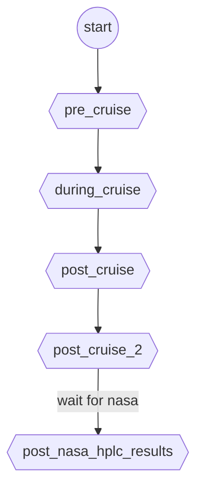

# workflow
Workflows are defined using mermaid-js-powered graphs to show what order tasks in the protocol must follow.
The over-arching workflow for tasks in the cruise is:

Once you have completed a task you must add a row to the cruise_checklist logsheet for that cruise in box.com.
The `cruise_checklist` sheet is located in `/imars_mbon_scruises/{cruiseYear}/{cruise_id}/metadata/fknms_sample_logsheet_{cruise_month}_{cruise_year}_{cruise_id}.xlsx`.

The entries should resemble:
task_name                    | your_name | datetime         | notes
-----------------------------|-----------|------------------|-------------------------------
pre_cruise/cruise_setup      | Sebastian | 2023-08-22T14:23 | modified chunk 2 as instructed
post_cruise/cdom_schedule    | Tylar     | 2023-09-01T12:22 |
post_cruise/merge_meta_edna  | Tylar     | 2023-09-01T11:43 | took a long time to run

folder                 | notes
-----------------------|---------------------------------------------------
old                    | scripts that are not part of the current protocol, but may be useful in the future
pre_cruise             |  do this before going on the cruise
during_cruise          | do this while on the boat
post_cruise            | do this immediately after returning
post_cruise_2          | do this after the cruise but not immediately
post_nasa_cdom_results | do this after data comes back from NASA

